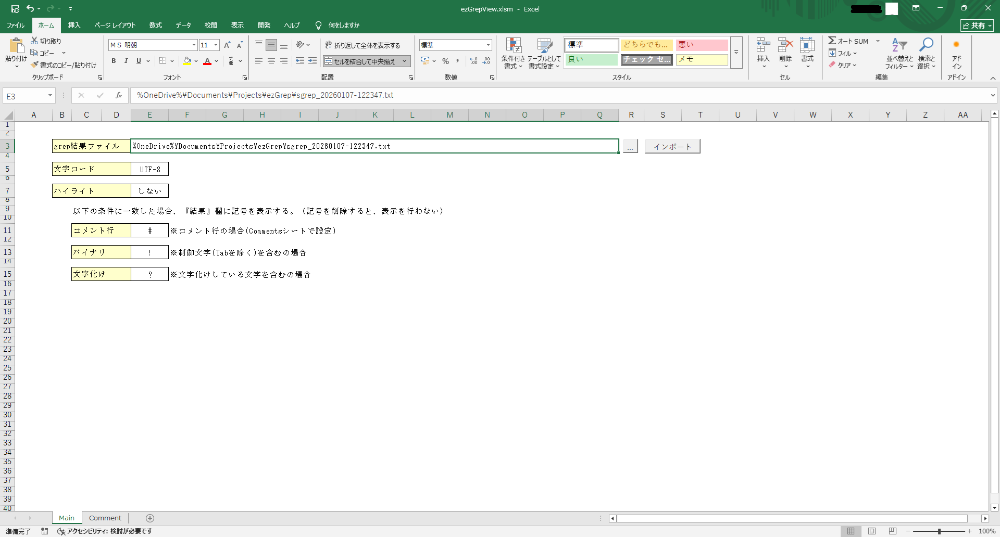
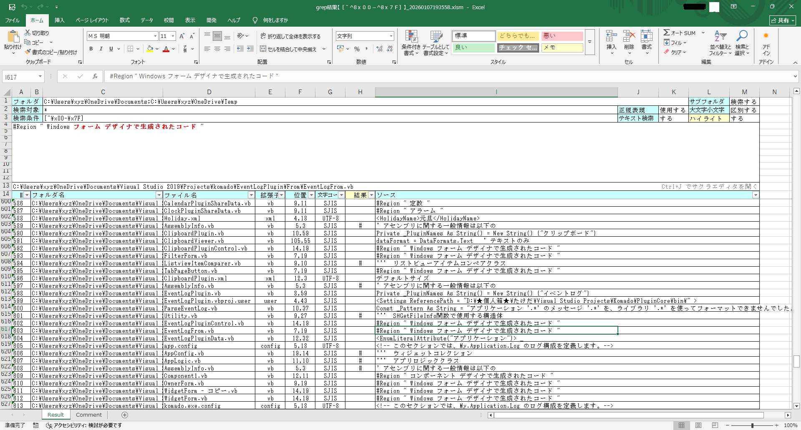
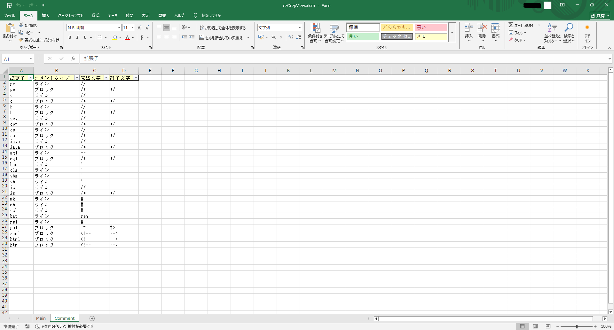

# 🔍 ezGrepView

サクラエディタの grep 検索結果を  
📊 **Excel マクロ（VBA）で読み込み・整形・可視化** するツールです。

大量の検索結果を Excel 上でスッキリ整理し、  
コメント行  、一致文字列 を色分け表示しながら、  
**ショートカット一発でエディタへジャンプ** できます。

---

## ✨ 特徴

- サクラエディタの grep 出力結果を Excel に取り込み
- grep ヘッダから検索条件を自動解析
- 検索結果を表形式で一覧表示
- 一致キーワードを **赤色＋太字** でハイライト
- コメント行を **緑色** で強調表示
- バイナリ行・文字化け行を自動判定
- `Ctrl + J` で **サクラエディタを起動し該当位置へジャンプ**
- 結果専用の Excel ファイルを自動生成

---

## 🖥 動作環境

- Windows 10 / 11
- Microsoft Excel（マクロ有効 / `.xlsm`）
- PowerShell 5.1 以上
- サクラエディタ  v2.4.1以上

---

## 🚀インストール

- 以下の GitHub Releases ページから最新版をダウンロード  
  👉 https://github.com/ichiriki-sha/ezGrepView/releases/

---

## 📸 デモ

- Main シート


- Result シート


- Comment シート


---

## 📑 シート構成

| シート名 | 内容 |
|--------|------|
| Main | 入力画面（grep結果・設定） |
| Result | 検索結果一覧・ソース表示 |
| Comment | 拡張子別コメント定義 |

---

## 🛠 使い方

### ① サクラエディタで grep 実行

サクラエディタで検索を実行し、 **結果をファイルとして保存** します。

### ② Main シートで設定

以下を入力・設定します。

- grep 結果ファイルのパス
- 文字コード（UTF-8 / Shift_JIS）
- ハイライト有無
- コメント／バイナリ／文字化け行のマーク文字

### ③ 取り込み実行
「取り込み」ボタンを押すと…

- grep ヘッダ解析
- 結果専用 Excel ファイル生成
- Result シートへ一覧出力

が自動で行われます。

### ④ Result シート操作

- 行選択でソース全文を表示
- 一致箇所・コメントを自動ハイライト
- `Ctrl + J` でサクラエディタを起動＆該当行へジャンプ

---

## 📁ディレクトリ構成

```powershell
ezGrepView/
├─ src/                        # Git管理の正
│   └─ *.bas / *.cls / *.dcm
├─ excel/
│   └─ ezGrepView.xlsm        # exportで自動生成（VBAなし）
├─ dev/
│   └─ ezGrepView.xlsm        # 開発用
├─ tools/
│   ├─ export_vba.ps1         # dev/Excel → src/ + excel/Excel
│   └─ import_vba.ps1         # src/ + excel/Excel → excel/Excel 
├─ .gitignore
├─ CHANGELOG.md
└─ README.md
```

---

## 📜 ライセンス

**MIT License**
